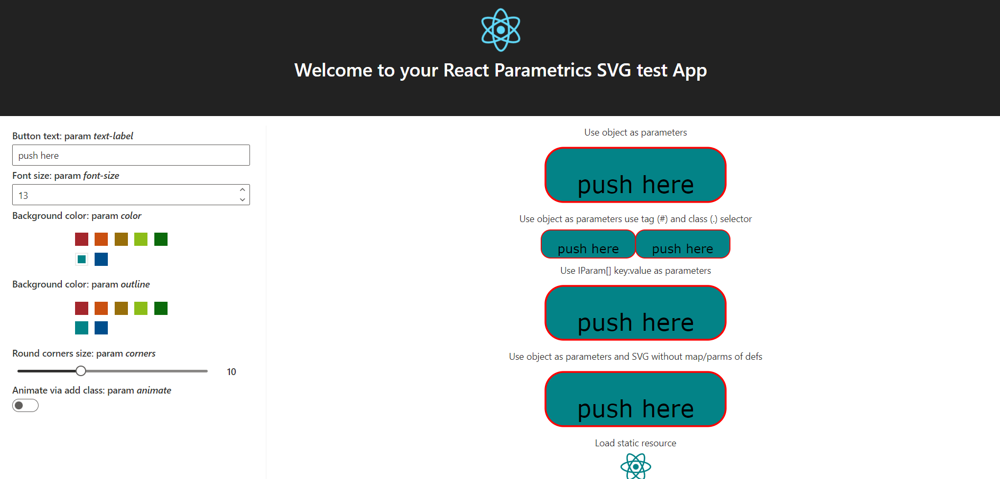

# react-parametrics-svg

> This is an extension of react-svg to support parameters with SVG based on this article [https://dev.w3.org/SVG/modules/ref/master/SVGRefPrimer.html]

[](https://www.npmjs.com/package/react-parametrics-svg) [](https://standardjs.com)

## Install

```bash
npm install --save react-parametrics-svg
```

## Usage

```tsx
import React, { Component } from 'react'
import ReactParametricsSVG from 'react-parametrics-svg'


class Example extends Component {
  render() {
    return <ReactParametricsSVG src='./my-chart.svg' params={{corners:'10', color:'red'}} />
  }
}
```
You can define parameters and parameters map inside SVG, defining elements for parameter ```<param id=[optional internal id] param=[parameter name] default=[parameter default value]/> ```.

and defining elements for parameter map ```<paramMap target=[selector for element/s] param=[parameter name to map] attributeName=[attribute to map]/> ```.

```xml
The attributes:
- target is the elemets selector, use: '#[id]' or '.[class name]' or '[tag id]'
- attributeName is the svg element attribute name or if missing is the inner HTML, for example use this to set the text of a label.

<svg xmlns="http://www.w3.org/2000/svg" xmlns:xlink="http://www.w3.org/1999/xlink"
       viewBox="0 0 110 40" width="100%" height="100%">

    <title>Reusable Button</title>
    <desc>Takes parameters from parent document"s embedding element.</desc>

    <defs id="params">
      <param id="paramRound" param="corners" default="15"/>
      <param id="paramBorder" param="color" default="red"/>
      <param id="paramText" param="text-label" default="button"/>
      <param id="paramStroke" param="outline" default="navy"/>
      <param id="paramFontSize" param="font-size" default="10"/>
    </defs>
    <defs id="params-map">
      <paramMap target="#button_rect" param="color" attributeName="fill"/>
      <paramMap target="#button_rect" param="outline" attributeName="stroke"/>
      <paramMap target="#button_rect" param="corners" attributeName="rx"/>
      <paramMap target="#button_rect" param="corners" attributeName="ry"/>
      <paramMap target="#button_label" param="font-size" attributeName="font-size"/>
      <paramMap target="#button_label" param="text-label"/>
    </defs>

    <g>
      <rect id="button_rect" x="5" y="5" width="100" height="30" rx="15" ry="15" 
            fill="blue" stroke="navy" />
      <text id="button_label" x="55" y="30" text-anchor="middle" 
            font-size="25" fill="black" font-family="Verdana"> </text>
    </g>
  </svg>
```

To pass paramater to the ```ReactParametricsSVG``` element use name|value array or object properties (note: camel case properties are mappend in dash case name e.g. fontSize => font-size)

If parameters are defined in the SVG only the parameters specified in it are used and mapped, if not, all parameters passed to the ```ReactParametricsSVG``` are mapped.

The map can be specificed or not in the SVG file, you can pass it to the ```ReactParametricsSVG``` with the attribute ```paramsMap```.
e.g. 
```tsx
<ReactParametricsSVG style={{display:'flex'}} src='./button-no-def.svg' 
                params={{corners:corner, color:color, outline:outline, textLabel:text, fontSize:fontSize}}
                paramsMap={[
                  {target:'#button_rect', param:'color', attributeName:'fill'},
                  {target:'#button_rect', param:'outline', attributeName:'stroke'},
                  {target:'#button_rect', param:'corners', attributeName:'rx'},
                  {target:'#button_rect', param:'corners', attributeName:'ry'},
                  {target:'#button_label', param:'font-size', attributeName:'font-size'},
                  {target:'#button_label', param:'text-label'}
                  ]}></ReactParametricsSVG>
```
Note the if a map is defined inside the SVG file, it is merged with the mappa passed as attriute ```ReactParametricsSVG```

In the folder /example you find a full featured react application:

## License

MIT © [Roberto Chinelli](https://github.com/roberchi)
